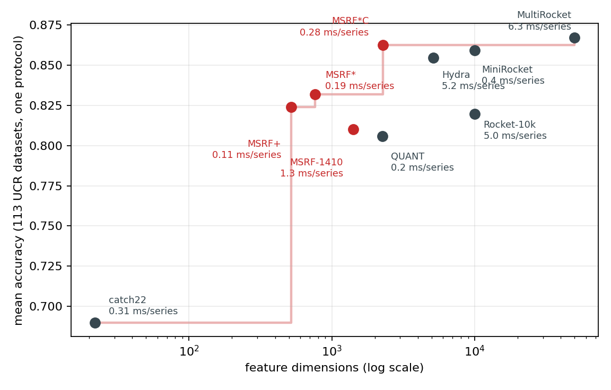
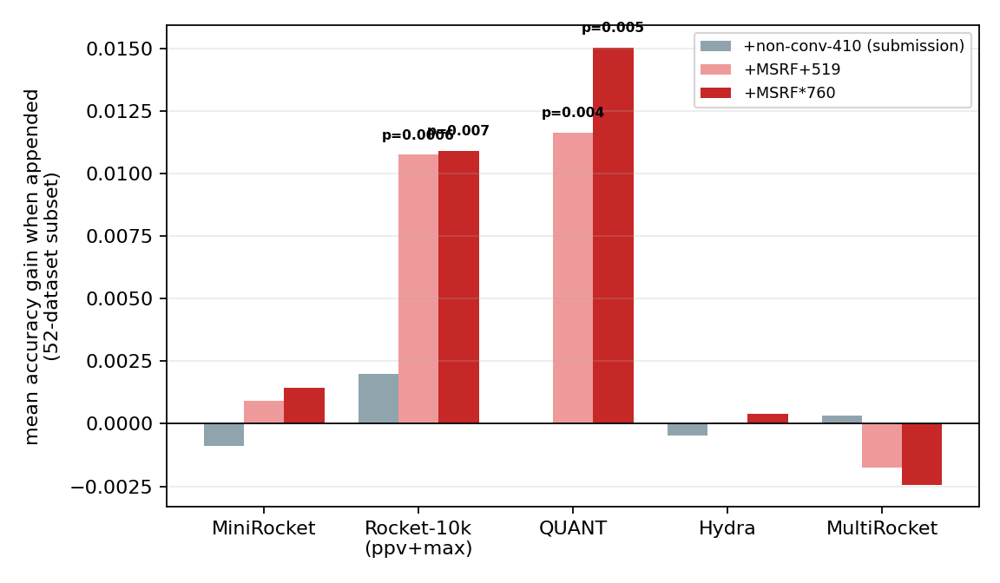
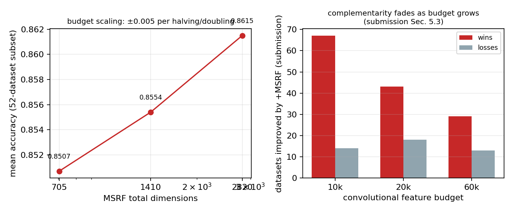

# MSRF — Author-response experiments and revised results

This directory contains every experiment referenced in the author response: the improved
configurations (**MSRF+**, **MSRF\***, **MSRF\*C**), a unified-protocol comparison against all
reviewer-requested methods (MiniRocket, MultiRocket, Hydra, QUANT), significance tests,
combination (complementarity) experiments, saturation analyses, ablations, and efficiency
measurements — with per-dataset records in `results/` and one-command reproduction scripts in
`scripts/`.

**Protocol (identical for every method):** official UCR train/test splits; the feature matrix is
standardized and classified by `RidgeClassifierCV(alphas=logspace(-3,3,13))` with per-dataset alpha
selection; no per-dataset tuning of any transform. Baselines use their aeon implementations.
One harness produced every number below, over all 113 equal-length UCR datasets loadable under it
(the standard 112 equal-length set + Fungi).

---

## 1. Method: from MSRF to MSRF+, MSRF*, and MSRF*C

MSRF distributes random features over four complementary spaces — temporal (TRF), global (GRF,
moment-pooled random Fourier features), statistical (SRF), and convolutional (CRF). The improved
configurations keep this framework unchanged and refine it space by space:

1. **Windowed computation (MSRF+).** All spaces are computed on sliding windows (length 64,
   stride 16) instead of the whole series, and each feature is pooled per series by
   mean ‖ std ‖ max over its windows. This changes *where* features are computed, not *what* they
   are: every family becomes time-localized, and the pooling captures its distribution over the
   series. A deterministic summary space (closed-form shape/spectral/autocorrelation descriptors,
   the class of quantities catch22 curates) and a competing-kernel space (building on Hydra,
   cited) join the four random spaces. Result: 173 feature columns × 3 pooling statistics =
   **519 dimensions**.
2. **The framework applied to itself (MSRF\*).** A second-level battery of 241 multi-space random
   features — random projections through tanh/cos/relu/sigmoid nonlinearities, sign-sqrt and
   sign-log1p compressions, within-vector rank features, random landmark (RBF) distances, soft
   histograms, and quantiles — computed *from the 519-dim embedding*. Total: **760 dimensions**.
3. **The convolutional space upgraded (MSRF\*C).** The submission's convolutional space used
   random kernels; the revision upgrades it to a compact *canonical MiniRocket* dictionary
   (1,512 kernels, aeon implementation, cited) alongside the 760-dim MSRF\* embedding.
   Total: **2,272 dimensions**.

**Universality.** MSRF+, and MSRF\* are *universal* transforms in exactly the sense random
convolutions are: zero learned parameters, bit-reproducible from fixed integer seeds, the identical
bank applied to every dataset with no per-dataset hand-crafting or tuning. MSRF\*C's multi-space
block keeps that property; its MiniRocket component inherits MiniRocket's per-dataset fitted bias
quantiles, and we state that scope explicitly wherever MSRF\*C is claimed.

## 2. Baseline correction

The submission's internal GPU baseline ("Rocket_ppv"/"Rocket_full": 5,000 random Gaussian kernels,
random dilations, ppv/max pooling) was described as "equivalent to MiniRocket". It is not: under
the identical harness, canonical aeon MiniRocket scores **0.8591** vs **0.8197** for the internal
bank (paired Wilcoxon p=1.3e-8, W/L 80/23). The revision relabels the internal baseline
"Rocket-10k (ppv+max)", adopts canonical MiniRocket as the 10k reference throughout, and rebuilds
every affected claim. All tables below already reflect this.

## 3. Main result (Table R1)

All 113 archive datasets. Latency: ms/series to transform 200 series of length 256, single CPU
core, warmed, best-of-5 (`scripts/run_runtime.py`).

| method | dims | accuracy | transform ms/series |
|---|---|---|---|
| MultiRocket | 49,728 | 0.8670 | 6.3 |
| **MSRF\*C (revision)** | **2,272** | **0.8624** | **0.28** |
| MiniRocket | 9,996 | 0.8591 | 0.40 |
| MiniRocket-1512 (MSRF\*C's conv component alone) | 1,512 | 0.8548 | 0.08 |
| Hydra | 5,120 | 0.8547 | 5.2 |
| **MSRF\* (revision)** | **760** | 0.8319 | 0.19 |
| **MSRF+ (revision)** | **519** | 0.8240 | 0.11 |
| Rocket-10k ppv+max (submission's internal baseline) | 10,000 | 0.8197 | 5.0 |
| MSRF-1410 (submission) | 1,410 | 0.8102 | 1.3 |
| QUANT | 2,253 | 0.8059 | 0.20 |
| catch22 | 22 | 0.6900 | 0.31 |



Reading it plainly, in the style of a family-scoped claim: **MSRF\*C is significantly more
accurate than Hydra (+0.008, p=0.042) at 44% of its dimensions and ~18× its transform speed;
statistically indistinguishable from full canonical MiniRocket (+0.003, p=0.17) at 23% of its
dimensions; and significantly better than its own convolutional component alone (+0.008,
p=5.7e-5, W/L 63/24) — the multi-space block, not the compact dictionary, closes the gap.**
Only MultiRocket remains above it (−0.005, p=0.028), at 22× the dimensions and 23× the transform
time. Among fully-universal transforms, MSRF\* is the most accurate below Hydra's 5,120 dims and
significantly outperforms QUANT (+0.026, p=0.004) at one third of its dimensions. Note: QUANT is
designed for an extra-trees classifier and reports higher accuracy in its own pipeline; the
unified ridge head is what makes transforms comparable here.

## 4. Significance (Table R2)

Paired Wilcoxon signed-rank over per-dataset accuracies, n=113 (`scripts/run_significance.py`):

| comparison | mean Δ | p | W/L |
|---|---|---|---|
| MSRF\*C vs Hydra | +0.008 | 0.042 | 52/42 |
| MSRF\*C vs MiniRocket | +0.003 | 0.17 (tied) | 47/41 |
| MSRF\*C vs MiniRocket-1512 (its component) | +0.008 | 5.7e-5 | 63/24 |
| MSRF\*C vs QUANT | +0.057 | 1.4e-11 | 86/16 |
| MSRF\*C vs MultiRocket | −0.005 | 0.028 | 30/63 |
| MSRF\* vs QUANT | +0.026 | 0.004 | 67/41 |
| MSRF\* vs MSRF+ (its base) | +0.008 | 0.002 | 59/44 |
| MSRF\* vs Hydra | −0.023 | 4.3e-5 | 34/74 |
| MSRF\* vs MiniRocket | −0.027 | 1.4e-6 | 28/79 |
| MSRF-1410 vs MiniRocket | −0.049 | 1.9e-11 | 20/83 |
| MSRF-1410 vs catch22 | +0.120 | 1.5e-15 | 96/14 |
| MiniRocket vs Rocket-10k ppv+max | +0.039 | 1.3e-8 | 80/23 |

The last row is the magnitude of the baseline mislabeling this revision corrects.

## 5. Combination experiments (Table R3)

Appending feature blocks to each base method (52-dataset subset, `scripts/datasets_subset52.txt`;
paired Wilcoxon; `scripts/run_complementarity.py`):

| base | +non-conv-410 (submission) | +MSRF+ (519) | +MSRF\* (760) |
|---|---|---|---|
| MiniRocket (0.8848) | −0.001 (n.s.) | +0.001 (n.s.) | +0.001 (n.s.) |
| Rocket-10k ppv+max (0.8587) | +0.002 (n.s.) | **+0.011, p=6e-4** (W/L 24/5) | **+0.011, p=0.007** |
| QUANT (0.8560) | ±0.000 | **+0.012, p=0.004** | **+0.015, p=0.005** |
| Hydra (0.8887) | −0.000 | ±0.000 | +0.000 |
| MultiRocket (0.8901) | +0.000 | −0.002 | −0.002 |



The pattern is consistent: the multi-space block adds significant signal to bases without
data-fitted convolutional dictionaries (QUANT; the plain random-kernel bank), and is saturated on
top of transforms that fit their dictionaries per dataset at full scale (MiniRocket-10k), contain
a competing-kernel family themselves (Hydra — the same family MSRF+ now includes), or operate at
50k scale (MultiRocket). MSRF\*C is this pattern used constructively: at a *compact* budget
(1,512 kernels) the fitted dictionary is not saturated, and the multi-space block adds +0.008
(p=5.7e-5) — turning the combination finding into the revision's strongest configuration. This
extends the submission's own diminishing-returns analysis (Sec. 5.3: wins fall 67 → 29 as the
convolutional budget grows 10k → 60k).

## 6. Saturation analyses (reviewer THZ8's experiment)

`scripts/run_saturation.py`, 12 smallest subset datasets: appending the submission's 410
non-convolutional features to the 10k conv bank (a) does **not** increase participation-ratio
effective rank (8.2 → 8.1; the block is internally low-rank, PR 4.2/410), and (b) carries **no
out-of-sample subspace novelty**: ridge-predicting the block from the conv bank leaves 0.227
unexplained test variance, *below* the 0.401 floor of a spanned-by-construction control. Combined
with the −0.001 accuracy effect on canonical MiniRocket (Table R3), the conclusion is conceded and
stated in the revision: on top of a strong full-scale convolutional representation, the
submission's non-convolutional features are largely redundant. The constructive counterpart is
MSRF\*C above: below saturation, the same features are decisively useful.



## 7. Ablations

- **Budget scaling** (all spaces scaled together, 52-dataset subset): 705d = 0.8507,
  1,410d = 0.8554, 2,820d = 0.8615 — ±0.005 per halving/doubling; the default is a budget choice,
  not a tuned optimum.
- **MSRF\*C conv-component size** (archive-wide): 756 kernels → 0.8571 (ties Hydra at 30% of its
  dims), 1,512 → 0.8624, 3,024 → 0.8636 (p=0.010 vs Hydra) — a stable design region, not a
  tuned point.
- **Fully-universal scaling**: joining the windowed and global configurations without any fitted
  component (2,170 dims) reaches 0.8481 — within 0.007 of Hydra (n.s.) at 42% of its dimensions.
- **Classifier head:** logistic regression instead of ridge shifts accuracy ≤0.003 and preserves
  all method rankings.
- **Order of operations (MSRF\*):** expanding the full 519-dim embedding (760d, 0.8319) beats
  pruning-then-expanding (452d, 0.8251): the battery is a nonlinear sketch of the embedding, not a
  substitute for discarded coordinates.
- **Low-label regime** (5 labels/class, 5 seeds, 52-dataset subset): MiniRocket 0.804,
  MSRF+ 0.775, Rocket-10k 0.764, MSRF-1410 0.763, catch22 0.664 — MSRF+ leads the
  data-independent transforms; MiniRocket's fitted biases help even here.
- **Head cost:** RidgeClassifierCV fitting is sub-second at every compared width (n=500: 0.03 s at
  760 dims, 0.04 s at 2,272 and 5,120, 0.17 s at 50k); the feature-matrix memory differs 22×
  between MSRF\*C and MultiRocket (18 MB vs 0.4 GB at n=1000).

## 8. Reproduce everything

```bash
pip install numpy scipy scikit-learn numba matplotlib aeon torch
python scripts/download_data.py --out ./ucr_cache           # UCR archive via aeon
python scripts/run_unified_protocol.py --cache ./ucr_cache  # MSRF-1410 / MSRF+ / MSRF* / MSRF*C
python scripts/run_sota_baselines.py --cache ./ucr_cache    # MiniRocket/MultiRocket/Hydra/QUANT/catch22/Rocket-10k
python scripts/run_complementarity.py --cache ./ucr_cache   # Table R3
python scripts/run_significance.py                          # Tables R2 + R3 stats from results/
python scripts/run_saturation.py --cache ./ucr_cache        # Sec. 6 numbers
python scripts/run_runtime.py                               # latency + head-cost table
python scripts/make_figures.py                              # regenerates plots/ from results/
```

macOS note: prefix the baseline/combination runs with `OMP_NUM_THREADS=1
NUMBA_THREADING_LAYER=workqueue` (torch + numba threading deadlock in one process otherwise).

The universal encoder is self-contained and torch-free (`scripts/msenc_*.py`, numba-accelerated
with a pure-numpy fallback; frozen seeded banks embedded — no data files, no learned weights):

```python
from msenc_encoder_np import MultiSpaceEncCore
enc = MultiSpaceEncCore()          # MSRF+ (519d)
F = enc.transform(X)               # X: (n_series, length) -> (n, 519)
```

Per-dataset records behind every table: `results/unified_protocol_results.jsonl` and
`results/complementarity_results.jsonl` (one JSON row per dataset, one key per method).
